# EORI Platform - Data Model Documentation

## Overview

The EORI Platform is a comprehensive administrative system for Romanian Orthodox Church parishes. It manages dioceses, parishes, document management, accounting, library, cemeteries, events, partners, and online forms.

## Entity Relationship Diagram

```mermaid
erDiagram
    %% Core Hierarchy
    DIOCESES ||--o{ DEANERIES : "contains"
    DEANERIES ||--o{ PARISHES : "contains"
    DIOCESES ||--o{ PARISHES : "direct"
    PARISHES ||--o{ DEPARTMENTS : "has"
    PARISHES ||--o{ USERS : "belongs_to"
    
    %% Authentication & Authorization
    USERS ||--o{ SESSIONS : "has"
    USERS ||--o{ USER_ROLES : "has"
    ROLES ||--o{ USER_ROLES : "assigned_to"
    ROLES ||--o{ ROLE_PERMISSIONS : "has"
    PERMISSIONS ||--o{ ROLE_PERMISSIONS : "granted_to"
    
    %% Partners & Parishioners
    PARISHES ||--o{ PARTNERS : "has"
    PARISHES ||--o{ PARISHIONERS : "has"
    PARISHIONER_CLASSIFICATIONS ||--o{ PARISHIONERS : "classifies"
    
    %% Document Management (Registratura)
    PARISHES ||--o{ REGISTER_CONFIGURATIONS : "has"
    REGISTER_CONFIGURATIONS ||--o{ GENERAL_REGISTER : "configures"
    PARISHES ||--o{ GENERAL_REGISTER : "has"
    GENERAL_REGISTER ||--o{ GENERAL_REGISTER_WORKFLOW : "tracks"
    GENERAL_REGISTER ||--o{ GENERAL_REGISTER_ATTACHMENTS : "has"
    
    PARISHES ||--o{ DOCUMENT_REGISTRY : "has"
    DOCUMENT_REGISTRY ||--o{ DOCUMENT_ATTACHMENTS : "has"
    DOCUMENT_REGISTRY ||--o{ DOCUMENT_WORKFLOW : "tracks"
    DOCUMENT_REGISTRY ||--o{ DOCUMENT_CONNECTIONS : "connects"
    DOCUMENT_REGISTRY ||--o{ DOCUMENT_ARCHIVE : "archived_in"
    DEPARTMENTS ||--o{ DOCUMENT_REGISTRY : "assigned_to"
    DOCUMENT_REGISTRY ||--o{ DOCUMENT_NUMBER_COUNTERS : "uses"
    
    %% Accounting
    PARISHES ||--o{ INVOICES : "has"
    PARISHES ||--o{ CONTRACTS : "has"
    PARISHES ||--o{ WAREHOUSES : "has"
    PARTNERS ||--o{ INVOICES : "partner_in"
    PARTNERS ||--o{ CONTRACTS : "partner_in"
    CONTRACTS ||--o{ CONTRACT_INVOICES : "generates"
    WAREHOUSES ||--o{ PRODUCTS : "stores"
    WAREHOUSES ||--o{ STOCK_MOVEMENTS : "tracks"
    INVOICES ||--o{ STOCK_MOVEMENTS : "linked_to"
    PRODUCTS ||--o{ STOCK_MOVEMENTS : "moved"
    PARISHES ||--o{ PAYMENTS : "has"
    
    %% Cemeteries
    PARISHES ||--o{ CEMETERIES : "has"
    CEMETERIES ||--o{ CEMETERY_PARCELS : "contains"
    CEMETERY_PARCELS ||--o{ CEMETERY_ROWS : "contains"
    CEMETERY_ROWS ||--o{ CEMETERY_GRAVES : "contains"
    CEMETERY_GRAVES ||--o{ CEMETERY_CONCESSIONS : "has"
    CEMETERY_CONCESSIONS ||--o{ CEMETERY_CONCESSION_PAYMENTS : "has"
    CEMETERY_GRAVES ||--o{ BURIALS : "contains"
    
    %% Library
    PARISHES ||--o{ LIBRARY_BOOKS : "has"
    LIBRARY_AUTHORS ||--o{ LIBRARY_BOOKS : "authored_by"
    LIBRARY_PUBLISHERS ||--o{ LIBRARY_BOOKS : "published_by"
    LIBRARY_DOMAINS ||--o{ LIBRARY_BOOKS : "categorized_in"
    LIBRARY_BOOKS ||--o{ LIBRARY_LOANS : "loaned"
    
    %% Events
    PARISHES ||--o{ CHURCH_EVENTS : "has"
    CHURCH_EVENTS ||--o{ CHURCH_EVENT_PARTICIPANTS : "has"
    CHURCH_EVENTS ||--o{ CHURCH_EVENT_DOCUMENTS : "has"
    CHURCH_EVENTS ||--o{ CHURCH_EVENT_EMAIL_SUBMISSIONS : "has"
    
    %% Online Forms
    PARISHES ||--o{ ONLINE_FORMS : "has"
    ONLINE_FORMS ||--o{ ONLINE_FORM_FIELDS : "contains"
    ONLINE_FORMS ||--o{ ONLINE_FORM_FIELD_MAPPINGS : "maps"
    ONLINE_FORMS ||--o{ ONLINE_FORM_SUBMISSIONS : "receives"
    ONLINE_FORM_SUBMISSIONS ||--o{ ONLINE_FORM_EMAIL_VALIDATIONS : "validates"
    PARISHES ||--o{ FORM_MAPPING_DATASETS : "has"
    
    %% Email Templates
    EMAIL_TEMPLATES ||--o{ ONLINE_FORMS : "used_by"
    
    %% User References
    USERS ||--o{ GENERAL_REGISTER : "created_by"
    USERS ||--o{ DOCUMENT_REGISTRY : "created_by"
    USERS ||--o{ INVOICES : "created_by"
    USERS ||--o{ CHURCH_EVENTS : "created_by"
    USERS ||--o{ ONLINE_FORMS : "created_by"
```

## Core Entities

### 1. Organizational Hierarchy

#### `dioceses` (Eparhii)
The highest level of the organizational structure.

**Key Attributes:**
- `id` (UUID, PK)
- `code` (VARCHAR(20), UNIQUE) - Unique diocese code
- `name` (VARCHAR(255)) - Diocese name
- `address`, `city`, `county`, `country` - Location information
- `phone`, `email`, `website` - Contact information
- `bishop_name` - Name of the bishop
- `is_active` (BOOLEAN) - Active status
- `created_at`, `updated_at` - Timestamps

**Relationships:**
- One-to-Many: `deaneries`, `parishes` (direct)

#### `deaneries` (Protopopiate)
Intermediate organizational level between dioceses and parishes.

**Key Attributes:**
- `id` (UUID, PK)
- `diocese_id` (UUID, FK → dioceses)
- `code` (VARCHAR(20), UNIQUE)
- `name` (VARCHAR(255))
- Location and contact fields similar to dioceses
- `is_active` (BOOLEAN)
- `created_at`, `updated_at`

**Relationships:**
- Many-to-One: `dioceses`
- One-to-Many: `parishes`

#### `parishes` (Parohii)
The primary organizational unit where most operations occur.

**Key Attributes:**
- `id` (UUID, PK)
- `deanery_id` (UUID, FK → deaneries, nullable)
- `diocese_id` (UUID, FK → dioceses)
- `code` (VARCHAR(20), UNIQUE)
- `name` (VARCHAR(255))
- `patron_saint_day` (DATE)
- Location fields: `address`, `city`, `county`, `postal_code`
- Coordinates: `latitude`, `longitude`
- Contact: `phone`, `email`, `website`
- `priest_name`, `vicar_name`
- `parishioner_count` (INTEGER)
- `founded_year` (INTEGER)
- `notes` (TEXT)
- `is_active` (BOOLEAN)
- `created_at`, `updated_at`

**Relationships:**
- Many-to-One: `dioceses`, `deaneries`
- One-to-Many: `departments`, `users`, `partners`, `parishioners`, `cemeteries`, `library_books`, `church_events`, `invoices`, `contracts`, `warehouses`, `document_registry`, `general_register`, `online_forms`, `register_configurations`

#### `departments` (Departamente)
Departments within a parish.

**Key Attributes:**
- `id` (UUID, PK)
- `parish_id` (UUID, FK → parishes)
- `code` (VARCHAR(20))
- `name` (VARCHAR(255))
- `description` (TEXT)
- `is_active` (BOOLEAN)
- `created_at`, `updated_at`

**Relationships:**
- Many-to-One: `parishes`
- One-to-Many: `document_registry`

### 2. Authentication & Authorization

#### `users`
System users (priests, secretaries, accountants, etc.).

**Key Attributes:**
- `id` (UUID, PK)
- `email` (VARCHAR(255), UNIQUE)
- `password_hash` (VARCHAR(255))
- `name` (VARCHAR(255))
- `address`, `city`, `phone`
- `is_active` (BOOLEAN)
- `approval_status` (ENUM: 'pending', 'approved', 'rejected')
- `role` (ENUM: 'episcop', 'vicar', 'paroh', 'secretar', 'contabil')
- `parish_id` (UUID, FK → parishes, nullable)
- `permissions` (TEXT[])
- `admin_notes` (TEXT)
- `reset_token`, `reset_token_expiry` - Password reset
- `verification_code`, `verification_code_expiry` - Email verification
- `created_at`, `updated_at`

**Relationships:**
- Many-to-One: `parishes`
- One-to-Many: `sessions`, `user_roles`
- Many-to-Many: `roles` (through `user_roles`)

#### `sessions`
User session management.

**Key Attributes:**
- `id` (UUID, PK)
- `user_id` (UUID, FK → users)
- `token` (VARCHAR(255), UNIQUE)
- `expires_at` (TIMESTAMP)
- `created_at` (TIMESTAMP)

**Relationships:**
- Many-to-One: `users`

#### `roles`
System roles for RBAC.

**Key Attributes:**
- `id` (UUID, PK)
- `name` (VARCHAR(100), UNIQUE)
- `description` (TEXT)
- `created_at`, `updated_at`

**Relationships:**
- Many-to-Many: `users` (through `user_roles`)
- Many-to-Many: `permissions` (through `role_permissions`)

#### `permissions`
System permissions for RBAC.

**Key Attributes:**
- `id` (UUID, PK)
- `name` (VARCHAR(100), UNIQUE)
- `description` (TEXT)
- `resource` (VARCHAR(100))
- `action` (VARCHAR(50))
- `created_at`, `updated_at`

**Relationships:**
- Many-to-Many: `roles` (through `role_permissions`)

#### `user_roles`
Junction table: Users ↔ Roles.

**Key Attributes:**
- `id` (UUID, PK)
- `user_id` (UUID, FK → users)
- `role_id` (UUID, FK → roles)
- `created_at` (TIMESTAMP)

#### `role_permissions`
Junction table: Roles ↔ Permissions.

**Key Attributes:**
- `id` (UUID, PK)
- `role_id` (UUID, FK → roles)
- `permission_id` (UUID, FK → permissions)
- `created_at` (TIMESTAMP)

### 3. Partners & Parishioners

#### `partners`
Business partners (suppliers, clients, organizations).

**Key Attributes:**
- `id` (UUID, PK)
- `parish_id` (UUID, FK → parishes)
- `type` (ENUM: 'person', 'company', 'organization')
- `category` (ENUM: 'supplier', 'client', 'both', 'other')
- `code` (VARCHAR(50))
- **Person fields:** `first_name`, `last_name`, `cnp`, `birth_date`
- **Company fields:** `company_name`, `cui`, `reg_com`
- **Common fields:** `address`, `city`, `county`, `postal_code`, `phone`, `email`
- **Financial:** `bank_name`, `iban`
- `notes` (TEXT)
- `is_active` (BOOLEAN)
- `created_at`, `created_by`, `updated_at`, `updated_by`
- `deleted_at` (TIMESTAMP) - Soft delete

**Relationships:**
- Many-to-One: `parishes`
- One-to-Many: `invoices`, `contracts`
- Referenced by: `document_registry` (sender/recipient)

#### `parishioners`
Parish members.

**Key Attributes:**
- `id` (UUID, PK)
- `parish_id` (UUID, FK → parishes)
- `classification_id` (UUID, FK → parishioner_classifications)
- `first_name`, `last_name` (VARCHAR(100))
- `cnp` (VARCHAR(13))
- `birth_date` (DATE)
- `address`, `city`, `county`, `postal_code`
- `phone`, `email`
- `baptism_date`, `confirmation_date`
- `notes` (TEXT)
- `is_active` (BOOLEAN)
- `created_at`, `updated_at`

**Relationships:**
- Many-to-One: `parishes`, `parishioner_classifications`

#### `parishioner_classifications`
Classification categories for parishioners.

**Key Attributes:**
- `id` (UUID, PK)
- `parish_id` (UUID, FK → parishes)
- `name` (VARCHAR(255))
- `description` (TEXT)
- `created_at`, `updated_at`

**Relationships:**
- Many-to-One: `parishes`
- One-to-Many: `parishioners`

### 4. Document Management (Registratura)

#### `register_configurations`
Configuration templates for general register.

**Key Attributes:**
- `id` (UUID, PK)
- `parish_id` (UUID, FK → parishes)
- `name` (VARCHAR(255))
- `description` (TEXT)
- `document_type` (ENUM: 'incoming', 'outgoing', 'internal')
- `numbering_format` (VARCHAR(100))
- `is_default` (BOOLEAN)
- `created_at`, `updated_at`

**Relationships:**
- Many-to-One: `parishes`
- One-to-Many: `general_register`

#### `general_register`
General document register (simplified document tracking).

**Key Attributes:**
- `id` (UUID, PK)
- `register_configuration_id` (UUID, FK → register_configurations)
- `parish_id` (UUID, FK → parishes)
- `document_number` (INTEGER)
- `year` (INTEGER)
- `document_type` (ENUM: 'incoming', 'outgoing', 'internal')
- `date` (DATE)
- `subject` (VARCHAR(500))
- `from`, `to` (VARCHAR(255))
- `description` (TEXT)
- `file_path` (TEXT)
- `status` (ENUM: 'draft', 'registered', 'in_work', 'distributed', 'resolved', 'archived', 'cancelled')
- `created_by` (UUID, FK → users)
- `created_at`, `updated_at`, `updated_by`

**Relationships:**
- Many-to-One: `parishes`, `register_configurations`, `users`
- One-to-Many: `general_register_workflow`, `general_register_attachments`

#### `general_register_workflow`
Workflow tracking for general register documents.

**Key Attributes:**
- `id` (UUID, PK)
- `register_entry_id` (UUID, FK → general_register)
- `status` (VARCHAR(50))
- `assigned_to` (UUID, FK → users)
- `notes` (TEXT)
- `created_at` (TIMESTAMP)

**Relationships:**
- Many-to-One: `general_register`, `users`

#### `general_register_attachments`
File attachments for general register documents.

**Key Attributes:**
- `id` (UUID, PK)
- `register_entry_id` (UUID, FK → general_register)
- `file_name` (VARCHAR(255))
- `file_path` (TEXT)
- `file_size` (INTEGER)
- `mime_type` (VARCHAR(100))
- `created_at` (TIMESTAMP)

**Relationships:**
- Many-to-One: `general_register`

#### `document_registry`
Advanced document registry with full workflow support.

**Key Attributes:**
- `id` (UUID, PK)
- `parish_id` (UUID, FK → parishes)
- `registration_number` (INTEGER)
- `registration_year` (INTEGER)
- `formatted_number` (VARCHAR(50))
- `document_type` (ENUM: 'incoming', 'outgoing', 'internal')
- `registration_date` (DATE)
- `external_number`, `external_date` - External document reference
- **Sender:** `sender_partner_id`, `sender_name`, `sender_doc_number`, `sender_doc_date`
- **Recipient:** `recipient_partner_id`, `recipient_name`
- `subject` (VARCHAR(500))
- `content` (TEXT)
- `priority` (ENUM: 'low', 'normal', 'high', 'urgent')
- `status` (ENUM: 'draft', 'registered', 'in_work', 'resolved', 'archived')
- `department_id` (UUID, FK → departments)
- `assigned_to` (UUID, FK → users)
- `due_date`, `resolved_date` (DATE)
- `file_index` (VARCHAR(50))
- `parent_document_id` (UUID, self-reference)
- `is_secret` (BOOLEAN)
- `secret_declassification_list` (TEXT[])
- `created_by` (UUID, FK → users)
- `created_at`, `updated_at`, `updated_by`
- `deleted_at` (TIMESTAMP) - Soft delete

**Relationships:**
- Many-to-One: `parishes`, `departments`, `users`, `partners` (sender/recipient)
- Self-reference: `parent_document_id`
- One-to-Many: `document_attachments`, `document_workflow`, `document_connections`, `document_archive`

#### `document_attachments`
File attachments for document registry.

**Key Attributes:**
- `id` (UUID, PK)
- `document_id` (UUID, FK → document_registry)
- `file_name` (VARCHAR(255))
- `file_path` (TEXT)
- `file_size` (INTEGER)
- `mime_type` (VARCHAR(100))
- `created_at` (TIMESTAMP)

**Relationships:**
- Many-to-One: `document_registry`

#### `document_workflow`
Workflow history for documents.

**Key Attributes:**
- `id` (UUID, PK)
- `document_id` (UUID, FK → document_registry)
- `status` (VARCHAR(50))
- `assigned_to` (UUID, FK → users)
- `notes` (TEXT)
- `created_at` (TIMESTAMP)
- `created_by` (UUID, FK → users)

**Relationships:**
- Many-to-One: `document_registry`, `users`

#### `document_connections`
Relationships between documents.

**Key Attributes:**
- `id` (UUID, PK)
- `source_document_id` (UUID, FK → document_registry)
- `target_document_id` (UUID, FK → document_registry)
- `connection_type` (VARCHAR(50)) - e.g., 'reply', 'related', 'attachment'
- `created_at` (TIMESTAMP)

**Relationships:**
- Many-to-One: `document_registry` (source and target)

#### `document_archive`
Archive information for documents.

**Key Attributes:**
- `id` (UUID, PK)
- `document_id` (UUID, FK → document_registry)
- `archive_location` (VARCHAR(255))
- `archive_date` (DATE)
- `archive_reference` (VARCHAR(100))
- `created_at` (TIMESTAMP)

**Relationships:**
- Many-to-One: `document_registry`

#### `document_number_counters`
Numbering counters for document registration.

**Key Attributes:**
- `id` (UUID, PK)
- `parish_id` (UUID, FK → parishes)
- `document_type` (ENUM: 'incoming', 'outgoing', 'internal')
- `year` (INTEGER)
- `counter` (INTEGER)
- `created_at`, `updated_at`

**Relationships:**
- Many-to-One: `parishes`

### 5. Accounting

#### `invoices`
Financial invoices (issued or received).

**Key Attributes:**
- `id` (UUID, PK)
- `parish_id` (UUID, FK → parishes)
- `series` (VARCHAR(20)) - Default: 'INV'
- `number` (NUMERIC(10,0))
- `invoice_number` (VARCHAR(50)) - Formatted number
- `type` (ENUM: 'issued', 'received')
- `date`, `due_date` (DATE)
- `partner_id` (UUID, FK → partners)
- `amount`, `vat`, `total` (NUMERIC(10,2))
- `currency` (VARCHAR(3)) - Default: 'RON'
- `status` (ENUM: 'draft', 'sent', 'paid', 'overdue', 'cancelled')
- `payment_date` (DATE)
- `description` (TEXT)
- `items` (JSONB) - Invoice line items
- `warehouse_id` (UUID, FK → warehouses, nullable)
- `created_by` (UUID, FK → users)
- `created_at`, `updated_at`, `updated_by`

**Relationships:**
- Many-to-One: `parishes`, `partners`, `warehouses`, `users`
- One-to-Many: `stock_movements` (linked)

#### `contracts`
Business contracts.

**Key Attributes:**
- `id` (UUID, PK)
- `parish_id` (UUID, FK → parishes)
- `partner_id` (UUID, FK → partners)
- `contract_number` (VARCHAR(50))
- `contract_date`, `start_date`, `end_date` (DATE)
- `subject` (VARCHAR(500))
- `description` (TEXT)
- `amount` (NUMERIC(10,2))
- `currency` (VARCHAR(3))
- `status` (VARCHAR(50))
- `template_id` (UUID, FK → contract_invoice_templates)
- `created_by` (UUID, FK → users)
- `created_at`, `updated_at`, `updated_by`

**Relationships:**
- Many-to-One: `parishes`, `partners`, `users`
- One-to-Many: `contract_invoices`

#### `contract_invoices`
Invoices generated from contracts.

**Key Attributes:**
- `id` (UUID, PK)
- `contract_id` (UUID, FK → contracts)
- `invoice_id` (UUID, FK → invoices)
- `created_at` (TIMESTAMP)

**Relationships:**
- Many-to-One: `contracts`, `invoices`

#### `contract_invoice_templates`
Templates for contract-based invoices.

**Key Attributes:**
- `id` (UUID, PK)
- `parish_id` (UUID, FK → parishes)
- `name` (VARCHAR(255))
- `description` (TEXT)
- `template_content` (TEXT)
- `created_at`, `updated_at`

**Relationships:**
- Many-to-One: `parishes`
- Referenced by: `contracts`

#### `warehouses`
Storage locations for inventory.

**Key Attributes:**
- `id` (UUID, PK)
- `parish_id` (UUID, FK → parishes)
- `code` (VARCHAR(20))
- `name` (VARCHAR(255))
- `address` (TEXT)
- `is_active` (BOOLEAN)
- `created_at`, `updated_at`

**Relationships:**
- Many-to-One: `parishes`
- One-to-Many: `products`, `stock_movements`
- Referenced by: `invoices`

#### `products`
Inventory items.

**Key Attributes:**
- `id` (UUID, PK)
- `parish_id` (UUID, FK → parishes)
- `warehouse_id` (UUID, FK → warehouses)
- `code` (VARCHAR(50))
- `name` (VARCHAR(255))
- `description` (TEXT)
- `unit` (VARCHAR(20)) - e.g., 'pcs', 'kg', 'm'
- `purchase_price`, `sale_price` (NUMERIC(10,2))
- `is_active` (BOOLEAN)
- `created_at`, `updated_at`

**Relationships:**
- Many-to-One: `parishes`, `warehouses`
- One-to-Many: `stock_movements`

#### `stock_movements`
Inventory movement transactions.

**Key Attributes:**
- `id` (UUID, PK)
- `warehouse_id` (UUID, FK → warehouses)
- `product_id` (UUID, FK → products)
- `movement_type` (ENUM: 'in', 'out', 'transfer', 'adjustment')
- `quantity` (NUMERIC(10,2))
- `unit_price` (NUMERIC(10,2))
- `invoice_id` (UUID, FK → invoices, nullable)
- `reference` (VARCHAR(100))
- `notes` (TEXT)
- `created_by` (UUID, FK → users)
- `created_at` (TIMESTAMP)

**Relationships:**
- Many-to-One: `warehouses`, `products`, `invoices`, `users`

#### `payments`
Payment transactions.

**Key Attributes:**
- `id` (UUID, PK)
- `parish_id` (UUID, FK → parishes)
- `partner_id` (UUID, FK → partners)
- `payment_date` (DATE)
- `amount` (NUMERIC(10,2))
- `currency` (VARCHAR(3))
- `payment_method` (VARCHAR(50))
- `reference` (VARCHAR(100))
- `description` (TEXT)
- `created_by` (UUID, FK → users)
- `created_at`, `updated_at`

**Relationships:**
- Many-to-One: `parishes`, `partners`, `users`

### 6. Cemeteries

#### `cemeteries`
Cemetery locations.

**Key Attributes:**
- `id` (UUID, PK)
- `parish_id` (UUID, FK → parishes)
- `code` (VARCHAR(20))
- `name` (VARCHAR(255))
- `address`, `city`, `county`
- `total_area` (NUMERIC(10,2))
- `total_plots` (INTEGER)
- `notes` (TEXT)
- `is_active` (BOOLEAN)
- `created_at`, `updated_at`

**Relationships:**
- Many-to-One: `parishes`
- One-to-Many: `cemetery_parcels`

#### `cemetery_parcels`
Sections/parcels within a cemetery.

**Key Attributes:**
- `id` (UUID, PK)
- `cemetery_id` (UUID, FK → cemeteries)
- `code` (VARCHAR(20))
- `name` (VARCHAR(255))
- `description` (TEXT)
- `created_at`, `updated_at`

**Relationships:**
- Many-to-One: `cemeteries`
- One-to-Many: `cemetery_rows`

#### `cemetery_rows`
Rows within a parcel.

**Key Attributes:**
- `id` (UUID, PK)
- `parcel_id` (UUID, FK → cemetery_parcels)
- `row_number` (INTEGER)
- `description` (TEXT)
- `created_at`, `updated_at`

**Relationships:**
- Many-to-One: `cemetery_parcels`
- One-to-Many: `cemetery_graves`

#### `cemetery_graves`
Individual graves.

**Key Attributes:**
- `id` (UUID, PK)
- `row_id` (UUID, FK → cemetery_rows)
- `grave_number` (INTEGER)
- `grave_type` (VARCHAR(50))
- `status` (VARCHAR(50)) - e.g., 'available', 'occupied', 'reserved'
- `notes` (TEXT)
- `created_at`, `updated_at`

**Relationships:**
- Many-to-One: `cemetery_rows`
- One-to-Many: `cemetery_concessions`, `burials`

#### `cemetery_concessions`
Grave concession agreements.

**Key Attributes:**
- `id` (UUID, PK)
- `grave_id` (UUID, FK → cemetery_graves)
- `concession_holder_name` (VARCHAR(255))
- `concession_holder_cnp` (VARCHAR(13))
- `start_date`, `end_date` (DATE)
- `concession_number` (VARCHAR(50))
- `notes` (TEXT)
- `created_at`, `updated_at`

**Relationships:**
- Many-to-One: `cemetery_graves`
- One-to-Many: `cemetery_concession_payments`

#### `cemetery_concession_payments`
Payments for grave concessions.

**Key Attributes:**
- `id` (UUID, PK)
- `concession_id` (UUID, FK → cemetery_concessions)
- `payment_date` (DATE)
- `amount` (NUMERIC(10,2))
- `payment_type` (VARCHAR(50)) - e.g., 'annual', 'one-time'
- `notes` (TEXT)
- `created_at` (TIMESTAMP)

**Relationships:**
- Many-to-One: `cemetery_concessions`

#### `burials`
Burial records.

**Key Attributes:**
- `id` (UUID, PK)
- `grave_id` (UUID, FK → cemetery_graves)
- `deceased_name` (VARCHAR(255))
- `deceased_cnp` (VARCHAR(13))
- `birth_date`, `death_date`, `burial_date` (DATE)
- `priest_name` (VARCHAR(255))
- `notes` (TEXT)
- `created_at`, `updated_at`

**Relationships:**
- Many-to-One: `cemetery_graves`

### 7. Library

#### `library_authors`
Book authors.

**Key Attributes:**
- `id` (UUID, PK)
- `name` (VARCHAR(255))
- `biography` (TEXT)
- `created_at`, `updated_at`

**Relationships:**
- One-to-Many: `library_books`

#### `library_publishers`
Book publishers.

**Key Attributes:**
- `id` (UUID, PK)
- `name` (VARCHAR(255))
- `address` (TEXT)
- `created_at`, `updated_at`

**Relationships:**
- One-to-Many: `library_books`

#### `library_domains`
Book subject domains/categories.

**Key Attributes:**
- `id` (UUID, PK)
- `name` (VARCHAR(255))
- `description` (TEXT)
- `parent_id` (UUID, FK → library_domains, nullable) - Hierarchical structure
- `created_at`, `updated_at`

**Relationships:**
- Self-reference: `parent_id`
- One-to-Many: `library_books`

#### `library_books`
Library book catalog.

**Key Attributes:**
- `id` (UUID, PK)
- `parish_id` (UUID, FK → parishes)
- `code` (VARCHAR(50))
- `title` (VARCHAR(500))
- `author_id` (UUID, FK → library_authors)
- `publisher_id` (UUID, FK → library_publishers)
- `domain_id` (UUID, FK → library_domains)
- `isbn` (VARCHAR(20))
- `publication_year` (INTEGER)
- `pages` (INTEGER)
- `copies` (INTEGER) - Total copies
- `available_copies` (INTEGER) - Available for loan
- `location` (VARCHAR(100))
- `status` (ENUM: 'available', 'borrowed', 'reserved', 'damaged', 'lost')
- `is_loanable` (BOOLEAN)
- `description` (TEXT)
- `created_at`, `updated_at`

**Relationships:**
- Many-to-One: `parishes`, `library_authors`, `library_publishers`, `library_domains`
- One-to-Many: `library_loans`

#### `library_loans`
Book loan records.

**Key Attributes:**
- `id` (UUID, PK)
- `book_id` (UUID, FK → library_books)
- `borrower_name` (VARCHAR(255))
- `borrower_contact` (VARCHAR(255))
- `loan_date`, `due_date`, `return_date` (DATE)
- `status` (VARCHAR(50)) - e.g., 'active', 'returned', 'overdue'
- `notes` (TEXT)
- `created_at`, `updated_at`

**Relationships:**
- Many-to-One: `library_books`

### 8. Events

#### `church_events`
Church events (weddings, baptisms, funerals).

**Key Attributes:**
- `id` (UUID, PK)
- `parish_id` (UUID, FK → parishes)
- `type` (ENUM: 'wedding', 'baptism', 'funeral')
- `status` (ENUM: 'pending', 'confirmed', 'completed', 'cancelled')
- `event_date` (DATE)
- `location` (VARCHAR(255))
- `priest_name` (VARCHAR(255))
- `notes` (TEXT)
- `created_by` (UUID, FK → users)
- `created_at`, `updated_at`, `updated_by`

**Relationships:**
- Many-to-One: `parishes`, `users`
- One-to-Many: `church_event_participants`, `church_event_documents`, `church_event_email_submissions`

#### `church_event_participants`
Participants in church events.

**Key Attributes:**
- `id` (UUID, PK)
- `event_id` (UUID, FK → church_events)
- `name` (VARCHAR(255))
- `role` (VARCHAR(50)) - e.g., 'bride', 'groom', 'godparent'
- `contact` (VARCHAR(255))
- `notes` (TEXT)
- `created_at` (TIMESTAMP)

**Relationships:**
- Many-to-One: `church_events`

#### `church_event_documents`
Documents related to church events.

**Key Attributes:**
- `id` (UUID, PK)
- `event_id` (UUID, FK → church_events)
- `document_type` (VARCHAR(50))
- `file_name` (VARCHAR(255))
- `file_path` (TEXT)
- `created_at` (TIMESTAMP)

**Relationships:**
- Many-to-One: `church_events`

#### `church_event_email_submissions`
Email submissions for event registration.

**Key Attributes:**
- `id` (UUID, PK)
- `event_id` (UUID, FK → church_events)
- `email` (VARCHAR(255))
- `submission_data` (JSONB)
- `status` (VARCHAR(50))
- `created_at` (TIMESTAMP)

**Relationships:**
- Many-to-One: `church_events`

### 9. Online Forms

#### `online_forms`
Configurable online forms for public submission.

**Key Attributes:**
- `id` (UUID, PK)
- `parish_id` (UUID, FK → parishes)
- `name` (VARCHAR(255))
- `description` (TEXT)
- `is_active` (BOOLEAN)
- `email_validation_mode` (ENUM: 'start', 'end') - When to validate email
- `submission_flow` (ENUM: 'direct', 'review') - Direct save or review required
- `target_module` (ENUM: 'registratura', 'general_register', 'events', 'partners')
- `widget_code` (VARCHAR(100), UNIQUE) - Embed code identifier
- `success_message`, `error_message` (TEXT)
- `created_by` (UUID, FK → users)
- `created_at`, `updated_at`, `updated_by`

**Relationships:**
- Many-to-One: `parishes`, `users`
- One-to-Many: `online_form_fields`, `online_form_field_mappings`, `online_form_submissions`

#### `online_form_fields`
Form field definitions.

**Key Attributes:**
- `id` (UUID, PK)
- `form_id` (UUID, FK → online_forms)
- `field_key` (VARCHAR(100)) - Internal field identifier
- `field_type` (ENUM: 'text', 'email', 'textarea', 'select', 'date', 'number', 'file')
- `label` (VARCHAR(255))
- `placeholder` (VARCHAR(255))
- `help_text` (TEXT)
- `is_required` (BOOLEAN)
- `validation_rules` (JSONB) - Custom validation rules
- `options` (JSONB) - For select fields
- `order_index` (INTEGER)
- `created_at` (TIMESTAMP)

**Relationships:**
- Many-to-One: `online_forms`

#### `online_form_field_mappings`
Mappings from form fields to database tables/columns.

**Key Attributes:**
- `id` (UUID, PK)
- `form_id` (UUID, FK → online_forms)
- `field_key` (VARCHAR(100))
- `target_table` (VARCHAR(100))
- `target_column` (VARCHAR(100))
- `transformation` (JSONB) - Data transformation rules
- `created_at` (TIMESTAMP)

**Relationships:**
- Many-to-One: `online_forms`

#### `online_form_submissions`
Form submission records.

**Key Attributes:**
- `id` (UUID, PK)
- `form_id` (UUID, FK → online_forms)
- `submission_token` (VARCHAR(100), UNIQUE)
- `status` (ENUM: 'pending_validation', 'validated', 'processing', 'completed', 'rejected')
- `email` (VARCHAR(255))
- `email_validated_at` (TIMESTAMP)
- `form_data` (JSONB) - Submitted form data
- `target_record_id` (UUID) - Created record ID in target module
- `submitted_at` (TIMESTAMP)
- `processed_at` (TIMESTAMP)
- `processed_by` (UUID, FK → users)

**Relationships:**
- Many-to-One: `online_forms`, `users`
- One-to-Many: `online_form_email_validations`

#### `online_form_email_validations`
Email validation codes for form submissions.

**Key Attributes:**
- `id` (UUID, PK)
- `submission_id` (UUID, FK → online_form_submissions)
- `email` (VARCHAR(255))
- `validation_code` (VARCHAR(10))
- `expires_at` (TIMESTAMP)
- `verified_at` (TIMESTAMP)
- `created_at` (TIMESTAMP)

**Relationships:**
- Many-to-One: `online_form_submissions`

#### `form_mapping_datasets`
Predefined mapping templates for form field mappings.

**Key Attributes:**
- `id` (UUID, PK)
- `name` (VARCHAR(255))
- `description` (TEXT)
- `target_module` (ENUM: 'registratura', 'general_register', 'events', 'partners')
- `parish_id` (UUID, FK → parishes, nullable)
- `is_default` (BOOLEAN)
- `mappings` (JSONB) - Mapping configuration
- `created_by` (UUID, FK → users)
- `created_at`, `updated_at`, `updated_by`

**Relationships:**
- Many-to-One: `parishes`, `users`

### 10. Email Templates

#### `email_templates`
Email template system.

**Key Attributes:**
- `id` (UUID, PK)
- `name` (VARCHAR(255))
- `subject` (VARCHAR(500))
- `body` (TEXT)
- `template_type` (VARCHAR(50))
- `variables` (JSONB) - Available template variables
- `is_active` (BOOLEAN)
- `created_at`, `updated_at`

**Relationships:**
- Referenced by: `online_forms` (for email notifications)

## Key Design Patterns

### 1. Multi-tenancy
- Most entities are scoped to `parish_id` for data isolation
- Users belong to parishes (with optional super-admin access)
- Each parish operates independently

### 2. Soft Deletes
- Entities like `partners`, `document_registry` use `deleted_at` for soft deletion
- Allows data recovery and audit trails

### 3. Audit Trails
- Most entities track `created_by`, `updated_by`, `created_at`, `updated_at`
- Workflow tables track status changes and assignments

### 4. Document Numbering
- `document_number_counters` manages sequential numbering per year/type
- `general_register` and `document_registry` use different numbering systems

### 5. File Management
- Attachment tables (`document_attachments`, `general_register_attachments`) store file metadata
- File paths stored as TEXT, actual files stored in filesystem

### 6. JSONB for Flexibility
- `invoices.items` - Line items
- `online_form_submissions.form_data` - Dynamic form data
- `form_mapping_datasets.mappings` - Flexible mapping configurations

### 7. Enum Types
- Extensive use of PostgreSQL ENUMs for type safety
- Status fields, document types, event types, etc.

## Business Rules

### Document Management
1. **General Register** - Simplified document tracking with basic workflow
2. **Document Registry** - Advanced document management with full workflow, assignments, and connections
3. Documents can be linked via `document_connections` or `parent_document_id`
4. Secret documents require special handling (`is_secret`, `secret_declassification_list`)

### Accounting
1. Invoices can be linked to warehouses for inventory tracking
2. Stock movements track inventory changes and can reference invoices
3. Contracts can generate invoices via `contract_invoices`
4. Payments are tracked separately and can be linked to invoices

### Online Forms
1. Forms support email validation at start or end of submission flow
2. Submissions can be processed directly or require review
3. Field mappings allow dynamic data insertion into target modules
4. Predefined mapping datasets enable quick form setup

### Access Control
1. Users belong to parishes (except super-admins)
2. RBAC system with roles, permissions, and role-permission assignments
3. User approval workflow (`approval_status`)
4. Parish-scoped data ensures multi-tenant isolation

## Indexes & Performance

### Recommended Indexes
- `parish_id` on all parish-scoped tables
- `email` on `users` (already UNIQUE)
- `widget_code` on `online_forms` (already UNIQUE)
- `submission_token` on `online_form_submissions` (already UNIQUE)
- Composite indexes on frequently queried combinations:
  - `(parish_id, document_type, year)` on `general_register`
  - `(parish_id, status)` on `document_registry`
  - `(warehouse_id, product_id)` on `stock_movements`

## Data Integrity

### Foreign Key Constraints
- All foreign keys properly defined with appropriate `ON DELETE` actions:
  - `CASCADE` - Child records deleted when parent deleted (e.g., `parishes` → `users`)
  - `SET NULL` - Foreign key set to NULL (e.g., `parishes` → `form_mapping_datasets`)
  - `RESTRICT` - Prevents deletion if child records exist (e.g., `register_configurations` → `general_register`)

### Unique Constraints
- `dioceses.code`, `deaneries.code`, `parishes.code` - Unique organizational codes
- `users.email` - Unique email addresses
- `online_forms.widget_code` - Unique widget codes for embedding
- `online_form_submissions.submission_token` - Unique submission tokens

## Future Considerations

1. **Notifications System** - Add notification preferences and delivery tracking
2. **Reports & Analytics** - Add reporting tables for analytics and dashboards
3. **Audit Log** - Comprehensive audit log table for all data changes
4. **File Storage** - Consider cloud storage integration (S3, etc.)
5. **Multi-language Support** - Add translation tables for multi-language content
6. **Calendar Integration** - Add calendar events and scheduling
7. **Communication Log** - Track all communications (emails, SMS, etc.)

