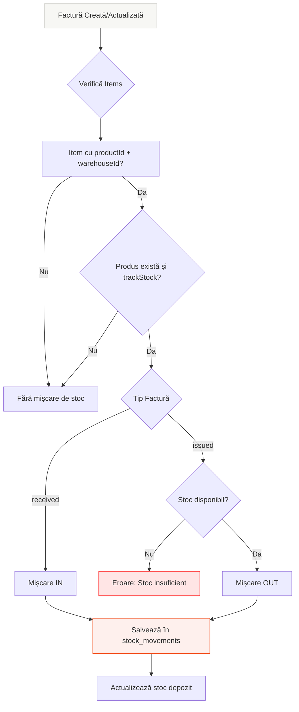

# Liniile de Factură, Produse și Mișcările de Stocuri

## Diagramă de Flux



## 1. Structura Liniilor de Factură (Invoice Items)

Liniile de factură sunt stocate în tabelul `invoices` în câmpul `items` de tip **JSONB** (array de obiecte).

### Schema unei Linii de Factură

```typescript
interface InvoiceItem {
  description: string;        // Descrierea produsului/serviciului
  quantity: number;           // Cantitatea
  unitPrice: number;          // Preț unitar
  vat?: number;              // TVA (opțional, default: 0)
  total: number;             // Total linie (quantity * unitPrice + vat)
  productId?: string | null;  // ID produs (opțional - doar pentru produse cu stoc)
  warehouseId?: string | null; // ID depozit (opțional - doar pentru produse cu stoc)
  unitCost?: number | null;   // Cost unitar (opțional - pentru facturi primite)
}
```

### Exemplu JSON în Baza de Date

```json
{
  "items": [
    {
      "description": "Produs A",
      "quantity": 10,
      "unitPrice": 100.00,
      "vat": 19.00,
      "total": 1019.00,
      "productId": "550e8400-e29b-41d4-a716-446655440000",
      "warehouseId": "660e8400-e29b-41d4-a716-446655440001",
      "unitCost": 80.00
    },
    {
      "description": "Serviciu consultanță",
      "quantity": 1,
      "unitPrice": 500.00,
      "vat": 95.00,
      "total": 595.00,
      "productId": null,
      "warehouseId": null,
      "unitCost": null
    }
  ]
}
```

## 2. Legătura cu Produsele

### Când o Linie de Factură are Produs

O linie de factură generează mișcări de stoc **DOAR** dacă:
- `productId` este setat (nu este `null`)
- `warehouseId` este setat (nu este `null`)
- Produsul există în baza de date
- Produsul are `trackStock = true`

### Verificare în Cod

```19:53:src/lib/stock-movements.ts
export async function generateStockMovementsFromInvoice(
  invoiceId: string,
  invoiceType: 'issued' | 'received',
  invoiceDate: string,
  invoiceItems: InvoiceItem[],
  parishId: string,
  clientId: string,
  userId: string
): Promise<void> {
  // Only process items that have productId and warehouseId
  const itemsWithStock = invoiceItems.filter(
    (item, index) => item.productId && item.warehouseId
  );

  if (itemsWithStock.length === 0) {
    return; // No stock items to process
  }

  // Determine movement type based on invoice type
  const movementType = invoiceType === 'issued' ? 'out' : 'in';

  // Create stock movements for each item
  for (let i = 0; i < itemsWithStock.length; i++) {
    const item = itemsWithStock[i];
    
    // Verify product exists and tracks stock
    const [product] = await db
      .select()
      .from(products)
      .where(eq(products.id, item.productId!))
      .limit(1);

    if (!product || !product.trackStock) {
      continue; // Skip if product doesn't exist or doesn't track stock
    }
```

## 3. Generarea Mișcărilor de Stocuri

### Tipul Mișcării

Tipul mișcării depinde de tipul facturii:
- **Facturi Ieșire (`issued`)** → Mișcări de tip **`out`** (ieșire din stoc)
- **Facturi Intrare (`received`)** → Mișcări de tip **`in`** (intrare în stoc)

### Validare pentru Facturi Ieșire

Pentru facturi de ieșire, se verifică disponibilitatea stocului:

```59:89:src/lib/stock-movements.ts
    // For 'out' movements, check stock availability
    if (movementType === 'out') {
      // Calculate current stock
      const stockResult = await db
        .select({
          quantity: sql<number>`COALESCE(SUM(CASE 
            WHEN type = 'in' THEN quantity::numeric
            WHEN type = 'out' THEN -quantity::numeric
            WHEN type = 'transfer' AND destination_warehouse_id IS NOT NULL THEN -quantity::numeric
            WHEN type = 'transfer' AND destination_warehouse_id IS NULL THEN quantity::numeric
            WHEN type = 'adjustment' THEN quantity::numeric
            WHEN type = 'return' THEN quantity::numeric
            ELSE 0
          END), 0)`,
        })
        .from(stockMovements)
        .where(
          and(
            eq(stockMovements.warehouseId, item.warehouseId!),
            eq(stockMovements.productId, item.productId!)
          )
        );

      const currentStock = Number(stockResult[0]?.quantity || 0);
      
      if (currentStock < item.quantity) {
        throw new Error(
          `Insufficient stock for product ${product.name}. Available: ${currentStock}, Required: ${item.quantity}`
        );
      }
    }
```

```91:110:src/lib/stock-movements.ts
    // Create stock movement
    await db.insert(stockMovements).values({
      warehouseId: item.warehouseId!,
      productId: item.productId!,
      parishId: parishId,
      type: movementType,
      movementDate: invoiceDate,
      quantity: item.quantity.toString(),
      unitCost: unitCost.toString(),
      totalValue: totalValue.toString(),
      invoiceId: invoiceId,
      invoiceItemIndex: i,
      documentType: 'invoice',
      documentNumber: invoiceId,
      documentDate: invoiceDate,
      clientId: clientId,
      notes: `Generated from invoice ${invoiceId}`,
      createdBy: userId,
    });
```

## 4. Structura Tabelului `stock_movements`

```12:32:database/schema/accounting/stock_movements.ts
export const stockMovements = pgTable('stock_movements', {
  id: uuid('id').primaryKey().defaultRandom(),
  warehouseId: uuid('warehouse_id').notNull().references(() => warehouses.id, { onDelete: 'cascade' }),
  productId: uuid('product_id').notNull().references(() => products.id, { onDelete: 'cascade' }),
  parishId: uuid('parish_id').notNull().references(() => parishes.id, { onDelete: 'cascade' }),
  type: stockMovementTypeEnum('type').notNull(),
  movementDate: date('movement_date').notNull(),
  quantity: numeric('quantity', { precision: 10, scale: 3 }).notNull(),
  unitCost: numeric('unit_cost', { precision: 15, scale: 4 }),
  totalValue: numeric('total_value', { precision: 15, scale: 2 }),
  invoiceId: uuid('invoice_id').references(() => invoices.id, { onDelete: 'set null' }),
  invoiceItemIndex: integer('invoice_item_index'),
  documentType: varchar('document_type', { length: 50 }),
  documentNumber: varchar('document_number', { length: 50 }),
  documentDate: date('document_date'),
  clientId: uuid('client_id').references(() => clients.id, { onDelete: 'set null' }),
  destinationWarehouseId: uuid('destination_warehouse_id').references(() => warehouses.id, { onDelete: 'set null' }),
  notes: text('notes'),
  createdBy: uuid('created_by').notNull().references(() => users.id),
  createdAt: timestamp('created_at', { withTimezone: true }).notNull().defaultNow(),
});
```

### Câmpuri Importante pentru Facturi

- **`invoiceId`**: ID-ul facturii care a generat mișcarea
- **`invoiceItemIndex`**: Indexul liniei de factură (0, 1, 2, ...) care a generat mișcarea
- **`type`**: `'in'` pentru facturi primite, `'out'` pentru facturi emise
- **`quantity`**: Cantitatea din linia de factură
- **`unitCost`**: Costul unitar (din `unitCost` sau calculat din `total/quantity`)
- **`totalValue`**: Valoarea totală (`quantity * unitCost`)

## 5. Fluxul Complet

### La Crearea Facturii

1. Se creează factura în tabelul `invoices` cu `items` (JSONB)
2. Se apelează `generateStockMovementsFromInvoice()`
3. Pentru fiecare linie cu `productId` și `warehouseId`:
   - Se verifică dacă produsul există și urmărește stocul
   - Pentru facturi ieșire: se verifică disponibilitatea stocului
   - Se creează o mișcare de stoc în `stock_movements`

### La Actualizarea Facturii

1. Se actualizează factura în `invoices`
2. Dacă `items` s-au modificat:
   - Se șterg mișcările vechi pentru această factură
   - Se generează mișcări noi pentru noile linii

### La Anularea/Ștergerea Facturii

1. Se apelează `reverseStockMovementsFromInvoice()`
2. Pentru fiecare mișcare de stoc legată de factură:
   - Se creează o mișcare inversă (dacă era `in` → `out`, dacă era `out` → `in`)

```116:153:src/lib/stock-movements.ts
export async function reverseStockMovementsFromInvoice(
  invoiceId: string,
  userId: string
): Promise<void> {
  // Find all stock movements linked to this invoice
  const movements = await db
    .select()
    .from(stockMovements)
    .where(eq(stockMovements.invoiceId, invoiceId));

  if (movements.length === 0) {
    return; // No movements to reverse
  }

  // Create reverse movements
  for (const movement of movements) {
    const reverseType = movement.type === 'in' ? 'out' : 'in';
    
    await db.insert(stockMovements).values({
      warehouseId: movement.warehouseId,
      productId: movement.productId,
      parishId: movement.parishId,
      type: reverseType,
      movementDate: new Date().toISOString().split('T')[0],
      quantity: movement.quantity,
      unitCost: movement.unitCost,
      totalValue: movement.totalValue,
      invoiceId: movement.invoiceId,
      invoiceItemIndex: movement.invoiceItemIndex,
      documentType: 'invoice_cancellation',
      documentNumber: movement.documentNumber,
      documentDate: movement.documentDate,
      clientId: movement.clientId,
      notes: `Reversal of movement from cancelled invoice ${invoiceId}`,
      createdBy: userId,
    });
  }
}
```

## 6. Exemplu Practic

### Factură Intrare (Received)

**Factură:**
- ID: `inv-001`
- Tip: `received`
- Client: `client-123`
- Data: `2024-01-15`

**Linii:**
1. Produs A - 10 buc × 100 RON = 1000 RON (cu stoc)
2. Serviciu B - 1 × 500 RON = 500 RON (fără stoc)

**Mișcări de Stoc Generate:**
- **DOAR pentru linia 1** (are `productId` și `warehouseId`)
  - `type`: `'in'`
  - `quantity`: `10`
  - `warehouseId`: depozit-1
  - `productId`: produs-A
  - `invoiceId`: `inv-001`
  - `invoiceItemIndex`: `0`

### Factură Ieșire (Issued)

**Factură:**
- ID: `inv-002`
- Tip: `issued`
- Client: `client-456`
- Data: `2024-01-20`

**Linii:**
1. Produs A - 5 buc × 120 RON = 600 RON (cu stoc)

**Mișcări de Stoc Generate:**
- **DOAR pentru linia 1** (are `productId` și `warehouseId`)
  - Se verifică stocul disponibil (trebuie să fie ≥ 5)
  - `type`: `'out'`
  - `quantity`: `5`
  - `warehouseId`: depozit-1
  - `productId`: produs-A
  - `invoiceId`: `inv-002`
  - `invoiceItemIndex`: `0`

## 7. Tabele Implicate

### Scriere (Write)
- **`invoices`**: Stocare factură cu linii în JSONB
- **`stock_movements`**: Mișcări de stoc generate automat

### Citire (Read)
- **`products`**: Verificare existență și `trackStock`
- **`warehouses`**: Validare depozit
- **`stock_movements`**: Calcul stoc disponibil (pentru facturi ieșire)
- **`clients`**: Validare client
- **`parishes`**: Validare parohie

## 8. Observații Importante

1. **Nu toate liniile generează mișcări**: Doar cele cu `productId` și `warehouseId` setate
2. **Validare stoc**: Pentru facturi ieșire, se verifică disponibilitatea înainte de generare
3. **Index linie**: `invoiceItemIndex` păstrează poziția liniei în array-ul `items`
4. **Anulare automată**: La anulare/ștergere, se creează mișcări inverse automat
5. **Cost unitar**: Se folosește `unitCost` dacă este setat, altfel se calculează din `total/quantity`

