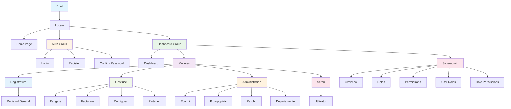

# Structura Paginilor - EORI Platform

## Diagramă Mermaid

## Structura Completă a Rutelor

### 1. Root & Locale
- `/` - Root page
- `/:locale` - Locale home page

### 2. Authentication Pages (Auth Group)
- `/:locale/login` - Login page
- `/:locale/register` - Registration page
- `/:locale/confirm-password` - Password confirmation page

### 3. Dashboard Pages
- `/:locale/dashboard` - Main dashboard

### 4. Modules Pages

#### Registratura
- `/:locale/dashboard/modules/registratura/registrul-general` - Registrul General

#### Gestiune
- `/:locale/dashboard/modules/gestiune/pangare` - Pangare
- `/:locale/dashboard/modules/gestiune/facturare` - Facturare
- `/:locale/dashboard/modules/gestiune/configurari` - Configurari
- `/:locale/dashboard/modules/gestiune/parteneri` - Parteneri (Partners)

#### Administration
- `/:locale/dashboard/modules/administration/eparhii` - Eparhii (Dioceses)
- `/:locale/dashboard/modules/administration/protopopiate` - Protopopiate (Deaneries)
- `/:locale/dashboard/modules/administration/parohii` - Parohii (Parishes)
- `/:locale/dashboard/modules/administration/departamente` - Departamente

#### Setari
- `/:locale/dashboard/modules/setari/utilizatori` - Utilizatori (Users)

### 5. Superadmin Pages
- `/:locale/dashboard/superadmin` - Superadmin overview
- `/:locale/dashboard/superadmin/roles` - Roles management
- `/:locale/dashboard/superadmin/permissions` - Permissions management
- `/:locale/dashboard/superadmin/user-roles` - User-Roles assignment
- `/:locale/dashboard/superadmin/role-permissions` - Role-Permissions assignment

## API Routes

### Authentication API
- `POST /api/auth/login` - User login
- `POST /api/auth/logout` - User logout
- `GET /api/auth/me` - Get current user
- `POST /api/auth/confirm-password` - Confirm password
- `POST /api/auth/skip-auth` - Skip authentication (dev)

### Core Entities API
- `GET|POST /api/dioceses` - List/Create dioceses
- `GET|PUT|DELETE /api/dioceses/:id` - Get/Update/Delete diocese
- `GET|POST /api/deaneries` - List/Create deaneries
- `GET|PUT|DELETE /api/deaneries/:id` - Get/Update/Delete deanery
- `GET|POST /api/parishes` - List/Create parishes
- `GET|PUT|DELETE /api/parishes/:id` - Get/Update/Delete parish
- `GET|POST /api/clients` - List/Create clients
- `GET|PUT|DELETE /api/clients/:id` - Get/Update/Delete client
- `GET /api/clients/:id/statement` - Get client financial statement

### Users API
- `GET|POST /api/users` - List/Create users
- `GET|PUT|DELETE /api/users/:id` - Get/Update/Delete user
- `POST /api/users/:id/resend-confirmation` - Resend confirmation email
- `GET /api/users/export` - Export users
- `POST /api/users/import` - Import users
- `GET /api/users/template` - Get import template

### Email Templates API
- `GET|POST /api/email-templates` - List/Create email templates
- `GET|PUT|DELETE /api/email-templates/:id` - Get/Update/Delete template
- `POST /api/email-templates/:id/send` - Send email template
- `POST /api/email-templates/:id/send-bulk` - Send bulk emails

### Superadmin API
- `GET|POST /api/superadmin/roles` - List/Create roles
- `GET|PUT|DELETE /api/superadmin/roles/:id` - Get/Update/Delete role
- `GET|POST /api/superadmin/permissions` - List/Create permissions
- `GET|PUT|DELETE /api/superadmin/permissions/:id` - Get/Update/Delete permission
- `POST /api/superadmin/permissions/bulk-delete` - Bulk delete permissions
- `GET|POST /api/superadmin/user-roles` - List/Assign user roles
- `GET|POST /api/superadmin/role-permissions` - List/Assign role permissions

## Legenda Culori

- 🔵 **Albastru** - Root & Locale
- 🟠 **Portocaliu** - Authentication
- 🟢 **Verde** - Dashboard
- 🟣 **Mov** - Modules
- 🔴 **Roz** - Superadmin

